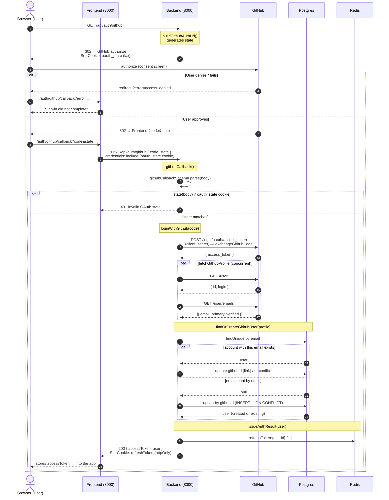

# GitHub OAuth login (COD-14)

Sign in with GitHub. GitHub redirects back to the frontend, which forwards the
one-time `code` to the backend over a `POST`. Tokens are never placed in a URL:
the backend returns the access token in the response body and the refresh token
in an httpOnly cookie — the same way password login works.

- Frontend: `http://localhost:3000`
- Backend: `http://localhost:8000`
- Endpoints: `GET /api/auth/github` (start), `POST /api/auth/github` (callback exchange)

## Notes

- The two redirect hops are plain browser navigation and carry no secrets — only
  `code` and `state` travel in the URL.
- `state` (CSRF): set as the `oauth_state` cookie on `GET /api/auth/github`, echoed
  back through GitHub, and compared against the request body in `githubCallback`.
- `exchangeGithubCode` is the only call that uses the client secret.
- `/user` and `/user/emails` are fetched concurrently (`Promise.all`); the email is
  taken only from `/user/emails` and must be verified.
- `findOrCreateGithubUser` links an existing account by email, otherwise creates via
  an atomic `upsert` on `githubId` so concurrent first logins can't double-create.
