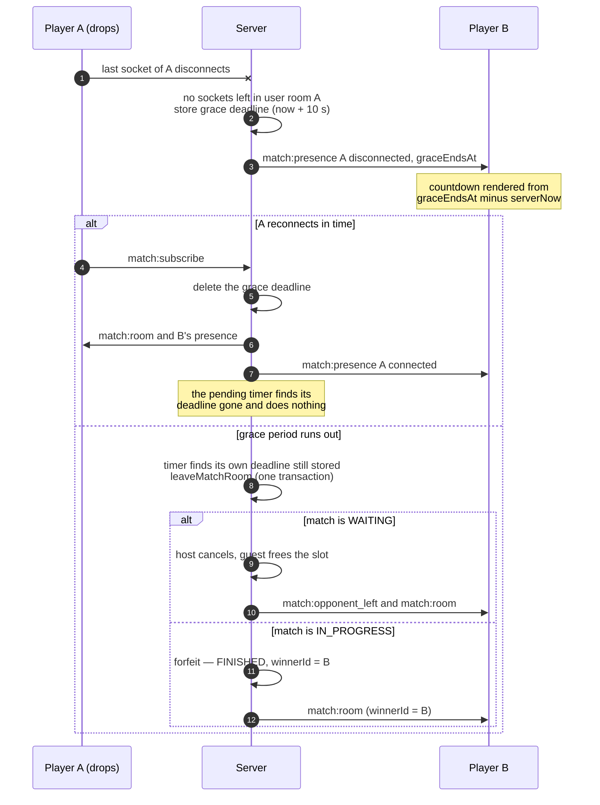

# Opponent presence and the reconnect grace period (COD-25)

Each player sees whether the opponent is connected and whether their tab is in
view, never their code. Presence is **not stored**: it is read from the live
sockets in the player's `user:<id>` room every time it is sent, so it cannot
drift from what the server actually holds.

Only sockets whose `socket.data.matchId` is **this** match count. A tab left open
on an earlier match stays in the user room until it closes, and must not keep the
player present in, or cancel the forfeit of, the match they are playing now. For
the same reason grace deadlines are keyed by match and player, not by player.

- Wire type: `PlayerPresence` in `packages/shared/src/match-room.events.ts`
- Server: `readPresence`, `startGracePeriod` in `src/modules/match/match.socket.ts`;
  the outcome of walking out is `leaveMatchRoom` in `match.service.ts`
- Client: `useMatchRoom` keeps the latest presence per user id

## Deriving presence

| Sockets in `user:<id>` | Any tab in view? | Presence |
| --- | --- | --- |
| at least one | yes (or not reported yet) | `connected`, `active: true` |
| at least one | no | `connected`, `active: false` (shown as AWAY) |
| none | — | `disconnected`, with `graceEndsAt` if a grace period is running |

`active` comes from the browser's `visibilitychange`. The server forwards it only
when a socket's value actually changes, so a client cannot turn it into a stream.

## Drop, grace period, reconnect

## Notes

- A deliberate `match:leave` takes the same path as an expired grace period, so
  leaving a running match concedes it rather than escaping the forfeit.
- Only the **last** socket to leave starts a grace period: another open tab keeps
  the player present.
- A timer acts only if the stored deadline is still the one it created. Without
  that check, a player who drops, reconnects and drops again would be forfeited
  by the first, shorter deadline.
- Grace deadlines and match timers both live in process memory. A restart loses
  them: a player who was mid-grace is then shown as disconnected with no
  deadline, and the match ends at `endsAt` instead of by forfeit.
- `graceEndsAt` travels with `serverNow`, the same way as the match timer, so a
  skewed client clock does not change the countdown.
