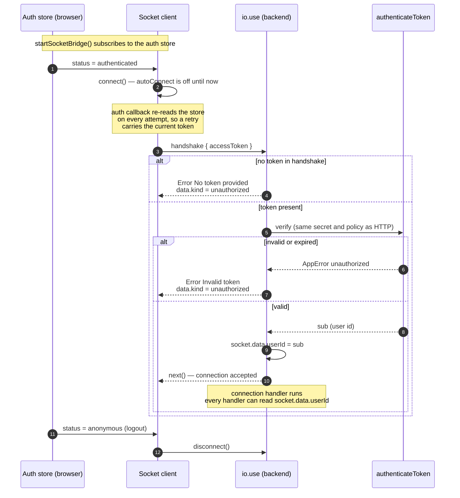
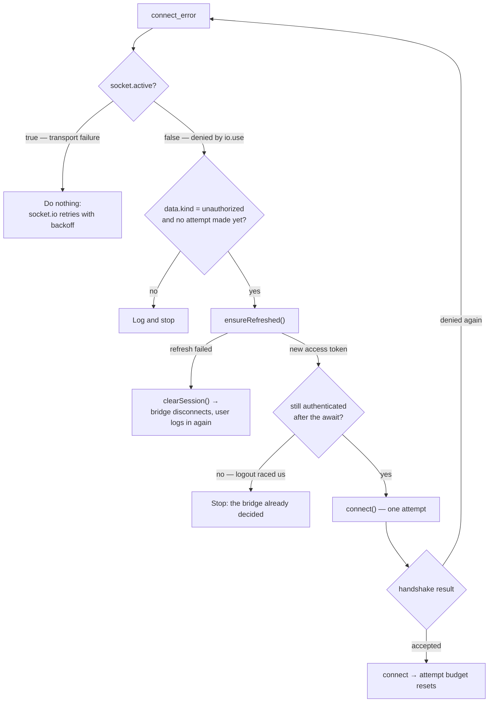
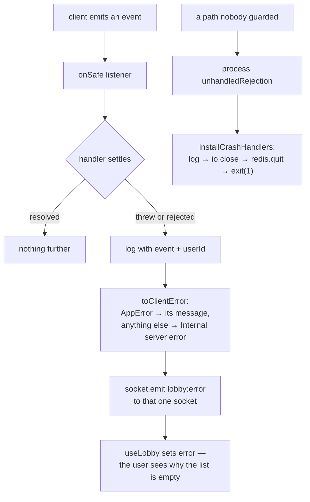

# Authenticated WebSocket connection (COD-21)

Socket.io runs on the same HTTP server as the REST API and shares its identity
rules. The difference is *when* identity is proven: HTTP carries a token on every
request, a socket proves itself **once**, during the handshake, and then stays
open for hours. Everything below follows from that asymmetry.

- Frontend: `http://localhost:3000` — one shared socket per tab (`apps/web/src/api/socket.ts`)
- Backend: `http://localhost:8000` — `createWebSocketServer` in `src/lib/socket.ts`
- Access token: sent as `handshake.auth.accessToken`, **not** an `Authorization` header

## Handshake

## Token expiry and recovery

A 15-minute access token expires long before the socket closes. When the client
then tries to reconnect, the handshake is denied — and socket.io treats a
middleware denial as final: it **disables its own reconnection and backoff**, so
nothing retries unless the application does.

That makes the retry loop the application's responsibility, and an unbounded one
would hammer `/api/auth/refresh` at network speed. `socket.active` separates the
two failure classes, and one recovery attempt per connection episode bounds the rest.

## Failures after the handshake

An accepted socket still runs handlers that touch the database. Socket.io calls
a listener and **discards the promise it returns**, so it has no `await` to
reject into and no wrapper to catch it — unlike Express 5, which routes a
rejected handler into the error middleware. An unguarded async listener
therefore turns a transient query failure into an `unhandledRejection`, and Node
ends the process: one client's failed subscribe would disconnect everyone,
including players mid-match.

`onSafe` (`src/lib/socket.ts`) is the registration every listener uses instead
of `socket.on`. It keeps the event name and its arguments typed from
`LobbyClientToServerEvents`, and settles the handler through a promise chain, so
a synchronous throw and a rejection take the same path.

`installCrashHandlers` (`src/lib/shutdown.ts`) is the net under that, not an
alternative to it: reaching it means an unknown path failed, so the process
stops rather than serving from a state no one can reason about. A forced
`exit(1)` bounds the close in case it hangs.

## Notes

- `authenticateToken` (`src/lib/jwt.ts`) is shared by the HTTP middleware and the
  socket handshake, so both transports accept exactly the same tokens.
- `toHandshakeError` flattens failures before they cross the wire: socket.io only
  forwards `message` and `data`, and unknown errors collapse to `kind: "internal"`
  rather than leaking internals.
- `kind` is currently `"unauthorized"` for both "this token expired" (a refresh
  fixes it) and "you may not connect" (a refresh never will). Once the handshake
  checks more than the token — a ban, a room membership — these must become
  distinct kinds, otherwise the client retries a denial it can never satisfy.
- Server-side listeners registered inside the `connection` handler are bound to
  that socket and are removed with it, so no explicit teardown is needed.
- The client keeps one socket per tab. Feature hooks subscribe to it and remove
  their own listeners on unmount; they never construct a second instance.
